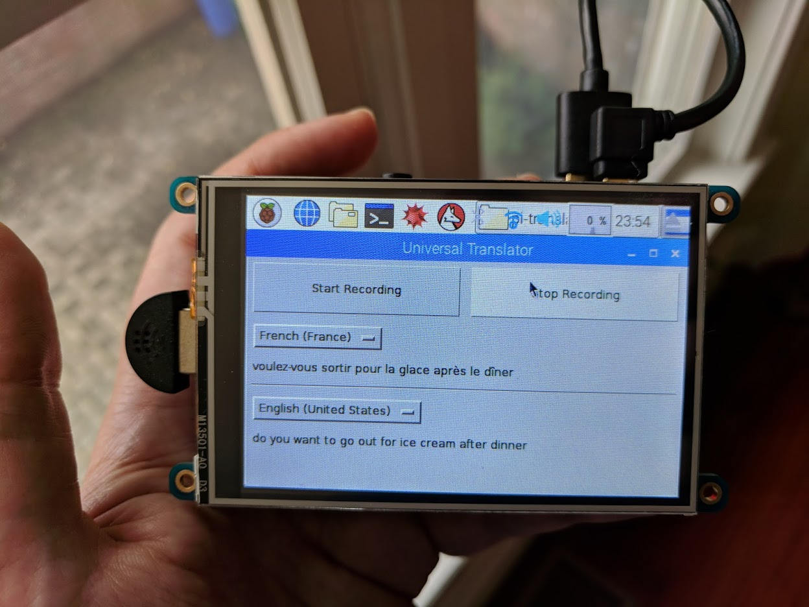

# This is a translator project for the Raspberry Pi.

Sometimes my wife and I need to discuss something at the dinner table in a way that the kids don't understand.  For example, "should we go out for ice cream after dinner?"  So we speak to each other in French or Russian.  My 10 year old son was tired of being left out and decided there should be a way to solve this problem.  He doesn't have a phone, and the Google Home wasn't near enough to the dinner table.

At the risk of giving up my private line of communication, I thought we could use this as incentive to learn a little bit of practical programming.

What we came up with was a battery powered raspberry pi based handheld translator using Google's APIs with a Python front end.




I wrapped Google's text to speech and translation apis in simple function calls for him to put together.  See the comments in Main.py.  To use this yourself, you'll need a google API key.  

```
# Three functions:
#
# 1.  record_file(<filename>)
#     records audio to the filename until the user hits enter
#
# 2.  speech_to_text(<languageCode>, <audio filename>)
#     converts the audio file to text using the language code provided.
#     Example language codes:
#       en-US - english-US
#       es-MX - spanish-Mexico
#       fr-FR - french-France
#     Returns the text
#
# 3. translate_text(<target language>, <text>)
#    translates the text to the target language
#    Example langauages are:
#      en - english
#      es - spanish
#      fr - french
#      de - german
#    Returns the translated text
```


Hardware used:

1. Raspberry Pi 3
1. Kinobo - USB 2.0 Mini Microphone "Makio" Mic for Laptop/Desktop PCs - Skype / VOIP / Voice Recognition Software by Kinobo; http://a.co/3Bddu6S
1. Edimax Dual Band USB Adapter; http://a.co/dbqHi7Z
1. Makerfocus Lithium Battery Expansion Board for Cellphone Raspberry Pi 3 Model B Pi 2B B+ by MakerFocus;  http://a.co/73bgiGZ
1. PiTFT Plus 480x320 3.5" TFT+Touchscreen for Raspberry Pi - Pi 2 and Model A+ / B+ by Adafruit; http://a.co/3EBihQq
